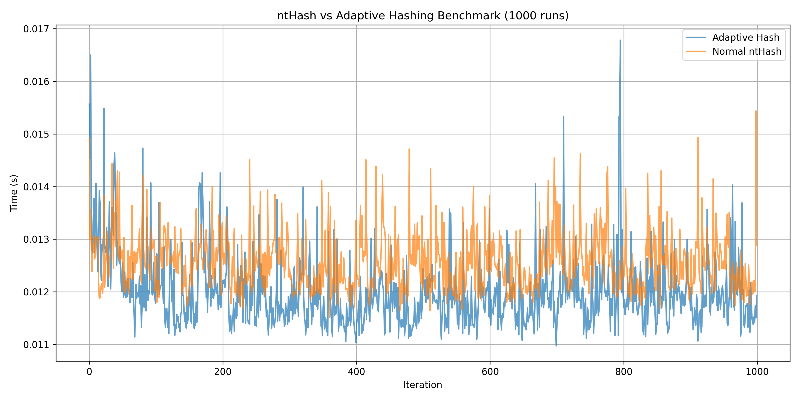

# Adaptive ntHash

This project extends the [`ntHash`](https://github.com/bcgsc/ntHash) library with an **adaptive spaced seed hashing mechanism** based on local sequence entropy. The implementation dynamically switches between sparse and dense spaced seed patterns during hashing to optimize performance, especially in regions of varying sequence complexity.

## Key Features

- **Adaptive Hashing**: Uses entropy thresholds to switch between sparse and dense seed configurations at runtime.
- **Optimized Rolling Entropy**: Efficient entropy computation using a rolling window and fixed-point log₂ lookup.
- **Faster Than Standard ntHash**: Consistently outperforms the standard ntHash across multiple benchmark runs.
- **Drop-in Integration**: Fully compatible with existing ntHash codebase and Meson build system.

## Benchmark Results

The plot below shows runtime (in seconds) for 1000 iterations of hashing a 1 million base pair sequence using standard ntHash vs the adaptive version.



## Build Instructions

This project uses the Meson build system.

```
git clone https://github.com/SiddharthaStoic/adaptive-nthash.git
cd adaptive-nthash
meson setup build --wipe
meson compile -C build
meson test -C build
```

## Run Benchmarks

```
# Adaptive hash benchmark
./build/adaptive_benchmark.exe

# Standard ntHash benchmark
./build/normal_benchmark.exe
```

## Contributing

This repository was developed as a high-performance extension to the ntHash project. Contributions are welcome to further optimize, test, or extend the adaptive entropy model.

## License

This project is licensed under the 